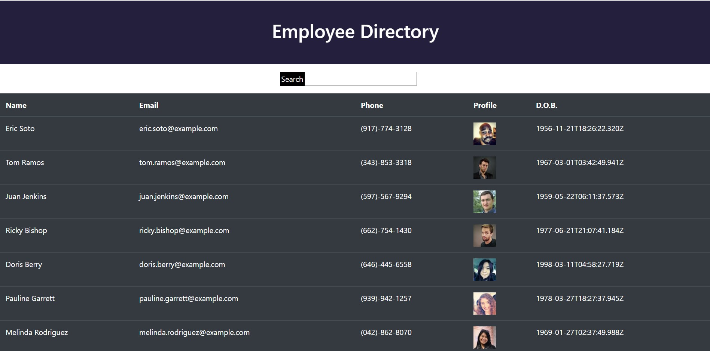

# README Generator

---

## Description

As a user, this employee directory application allows quick access to each employees information. Non-sensitive data is filtered and easily viewed through a table format.

## Goals

1. Using the [Random User API](https://randomuser.me/), a list of users is rendered to provide employee information
2. Non-sensitive data for each employee is provided through a table format
3. Employees are able to be sorted and filtered by at least one property or category
4. A screenshot and link are provided to preview the application

 
[Employee Directory]()

## Technology Used

- ReactJS
- Axios
- JQuery

## Table of Contents

[Installation](#installation) 
[Usage](#usage) 
[Contributions](#contributions) 
[Description](#description) 

## Installation

N/A

## Usage

Employee management.

## Contributions

Jon Keopangna

## Testing

N/A

## License

 
For more information use the link provided.

## Contact For Questions

Github: [Jkeopangna](https://github.com/jkeopangna/UserDirectory) 
Email: [Jkeopangna@gmail](https://gmail.com)
